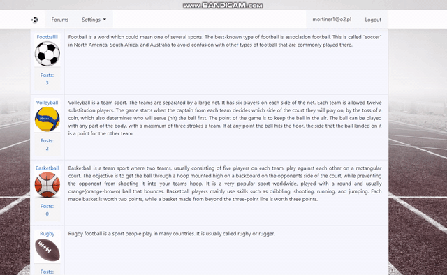
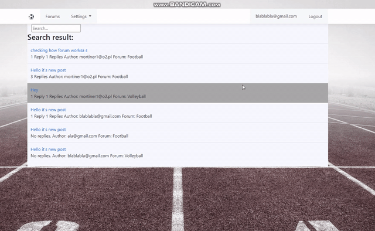

# Sport Forum
> A forum with sub-forum where you can add posts about any sports. 

## Used
+ .Net Core
+ EF Core
+ LINQ
+ .Net Core Identity
+ .Net Core Authorization

## Current functionality
+ [x] regitration
+ [x] login/logout
+ [x] adding posts
+ [x] adding replies
+ [x] creating forum with new logo
+ [x] edit forum
+ [x] delete forum with confiramtion alert
+ [x] ban user functionality
+ [x] user / admin roles
+ [x] global search 
+ [x] local search on sub-forums
+ [x] delete post as admin and user

## To do
+ [ ] Verify email via activation link
+ [ ] Redesign Identity basic functionality
+ [ ] Create claims based on roles
+ [ ] Upgrade search functionality for replies
+ [ ] User msges functionality
+ [ ] Adding information when post is edited (by admin or user)
+ [ ] Change user profile pic

## User functionality

## Admin functionality 

## Admin roles managment

## Creating forum and looking into details of users

## Search Bar

## Bammed user tries to login 

